viz_part1
================
Ze Li
2023-09-28

``` r
library(tidyverse)
```

    ## ── Attaching core tidyverse packages ──────────────────────── tidyverse 2.0.0 ──
    ## ✔ dplyr     1.1.3     ✔ readr     2.1.4
    ## ✔ forcats   1.0.0     ✔ stringr   1.5.0
    ## ✔ ggplot2   3.4.3     ✔ tibble    3.2.1
    ## ✔ lubridate 1.9.2     ✔ tidyr     1.3.0
    ## ✔ purrr     1.0.2     
    ## ── Conflicts ────────────────────────────────────────── tidyverse_conflicts() ──
    ## ✖ dplyr::filter() masks stats::filter()
    ## ✖ dplyr::lag()    masks stats::lag()
    ## ℹ Use the conflicted package (<http://conflicted.r-lib.org/>) to force all conflicts to become errors

``` r
library(ggridges)
```

Get the data for plotting today.

``` r
weather_df = 
  rnoaa::meteo_pull_monitors(
    c("USW00094728", "USW00022534", "USS0023B17S"),
    var = c("PRCP", "TMIN", "TMAX"), 
    date_min = "2021-01-01",
    date_max = "2022-12-31") |>
  mutate(
    name = recode(
      id, 
      USW00094728 = "CentralPark_NY", 
      USW00022534 = "Molokai_HI",
      USS0023B17S = "Waterhole_WA"),
    tmin = tmin / 10,
    tmax = tmax / 10) |>
  select(name, id, everything())
```

    ## using cached file: /Users/zeze/Library/Caches/org.R-project.R/R/rnoaa/noaa_ghcnd/USW00094728.dly

    ## date created (size, mb): 2023-10-09 17:57:46.959077 (0.343)

    ## file min/max dates: 2021-01-01 / 2023-10-31

    ## using cached file: /Users/zeze/Library/Caches/org.R-project.R/R/rnoaa/noaa_ghcnd/USW00022534.dly

    ## date created (size, mb): 2023-10-09 17:57:47.880737 (0.282)

    ## file min/max dates: 2021-01-01 / 2023-10-31

    ## using cached file: /Users/zeze/Library/Caches/org.R-project.R/R/rnoaa/noaa_ghcnd/USS0023B17S.dly

    ## date created (size, mb): 2023-10-09 17:57:48.352621 (0.122)

    ## file min/max dates: 2021-01-01 / 2023-10-31

Let’s make a plot!

``` r
ggplot(weather_df, aes(x = tmin, y = tmax))+
  geom_point()
```

    ## Warning: Removed 17 rows containing missing values (`geom_point()`).

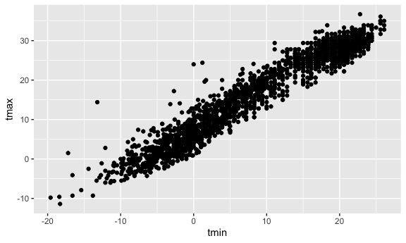<!-- -->

### Pipes and stuff

``` r
weather_df |>
  filter(name == "CentralPark_NY") |>
  ggplot(aes(x = tmin, y = tmax))+
  geom_point()
```

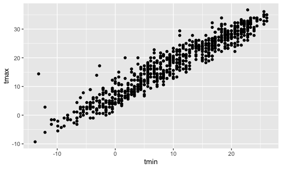<!-- -->

``` r
ggp_nyc_weather = 
  weather_df |>
  filter(name == "CentralPark_NY") |>
  ggplot(aes(x = tmin, y = tmax))+
  geom_point()

ggp_nyc_weather 
```

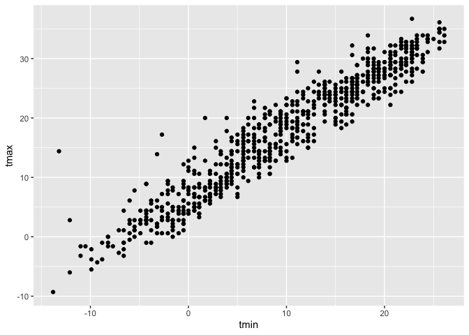<!-- -->

## Fancy plot

``` r
ggplot(weather_df, aes(x= tmin, y = tmax)) +
  geom_point(aes(color = name)) +
  geom_smooth()
```

    ## `geom_smooth()` using method = 'gam' and formula = 'y ~ s(x, bs = "cs")'

    ## Warning: Removed 17 rows containing non-finite values (`stat_smooth()`).

    ## Warning: Removed 17 rows containing missing values (`geom_point()`).

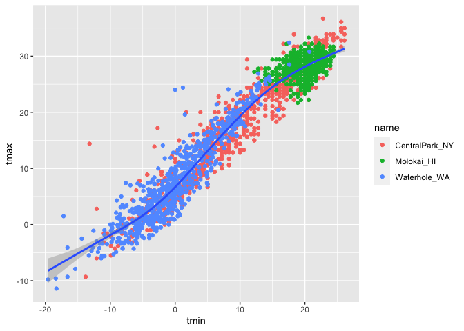<!-- -->

``` r
ggplot(weather_df, aes(x= tmin, y = tmax)) +
  geom_point(aes(color = name)) +
  geom_smooth(se = FALSE)
```

    ## `geom_smooth()` using method = 'gam' and formula = 'y ~ s(x, bs = "cs")'

    ## Warning: Removed 17 rows containing non-finite values (`stat_smooth()`).
    ## Removed 17 rows containing missing values (`geom_point()`).

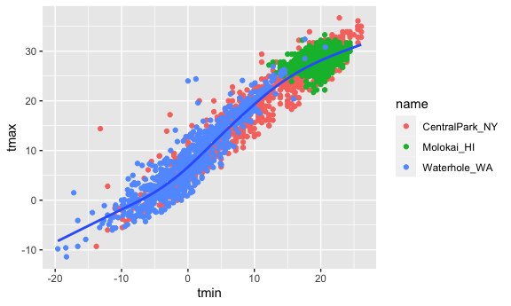<!-- -->

``` r
ggplot(weather_df, aes(x= tmin, y = tmax)) +
  geom_point(aes(color = name), alpha = 0.3) +
  geom_smooth(se = FALSE)
```

    ## `geom_smooth()` using method = 'gam' and formula = 'y ~ s(x, bs = "cs")'

    ## Warning: Removed 17 rows containing non-finite values (`stat_smooth()`).
    ## Removed 17 rows containing missing values (`geom_point()`).

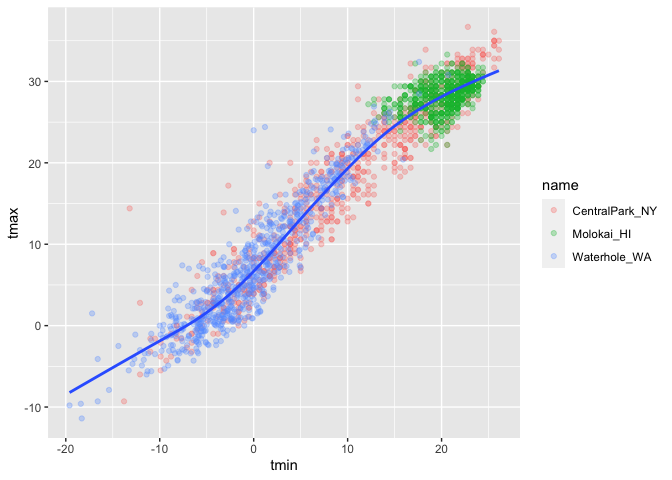<!-- -->

### facets

Plot with facets

``` r
ggplot(weather_df, aes(x= tmin, y = tmax, color = name)) +
  geom_point(alpha = 0.3) +
  geom_smooth() +
  facet_grid(. ~ name)
```

    ## `geom_smooth()` using method = 'loess' and formula = 'y ~ x'

    ## Warning: Removed 17 rows containing non-finite values (`stat_smooth()`).

    ## Warning: Removed 17 rows containing missing values (`geom_point()`).

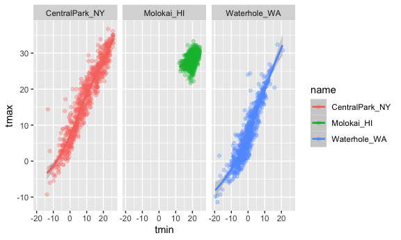<!-- -->

``` r
ggplot(weather_df, aes(x= tmin, y = tmax, color = name)) +
  geom_point(alpha = 0.3) +
  geom_smooth() +
  facet_grid(name ~ .)
```

    ## `geom_smooth()` using method = 'loess' and formula = 'y ~ x'

    ## Warning: Removed 17 rows containing non-finite values (`stat_smooth()`).
    ## Removed 17 rows containing missing values (`geom_point()`).

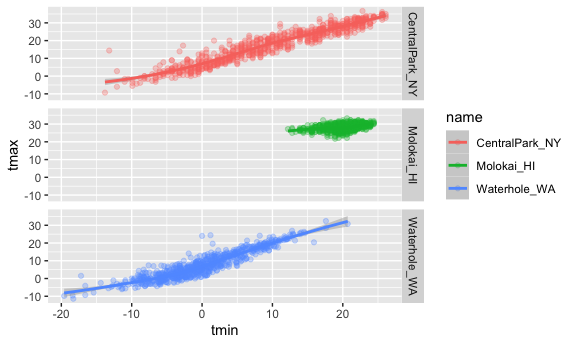<!-- -->

Let’s try a different plot. temps are boring

``` r
ggplot(weather_df, aes(x= date, y = tmax, color = name)) +
  geom_point(aes(size = prcp), alpha = 0.3) +
  geom_smooth() +
  facet_grid(. ~ name)
```

    ## `geom_smooth()` using method = 'loess' and formula = 'y ~ x'

    ## Warning: Removed 17 rows containing non-finite values (`stat_smooth()`).

    ## Warning: Removed 19 rows containing missing values (`geom_point()`).

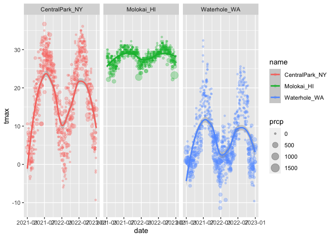<!-- -->

try assigning a specific color

``` r
weather_df |> 
  filter(name == "CentralPark_NY") |>
  ggplot(aes(x = date, y = tmax)) +
  geom_point(color = "blue")
```

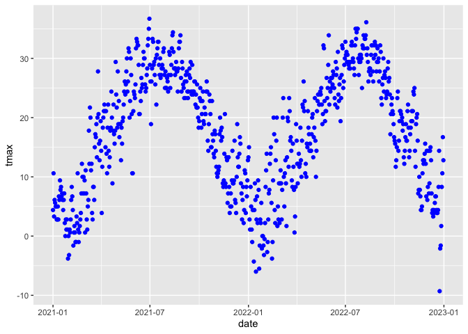<!-- -->

``` r
weather_df |> 
  filter(name != "CentralPark_NY") |>
  ggplot(aes(x = date, y = tmax, color = name)) +
  geom_point(alpha = 0.7, size = 0.5)
```

    ## Warning: Removed 17 rows containing missing values (`geom_point()`).

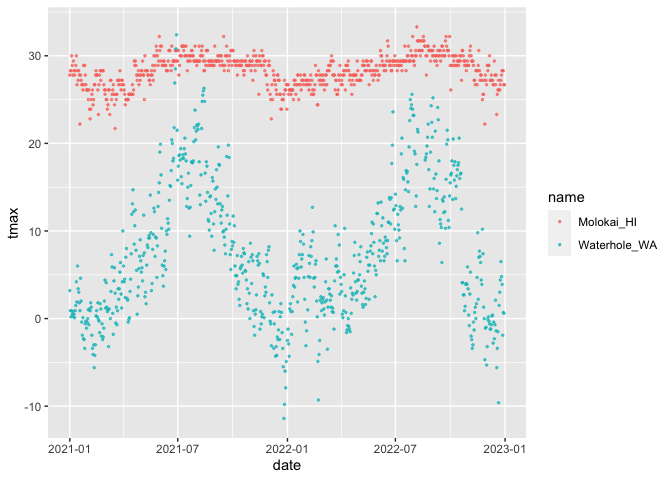<!-- -->

### hex plot

``` r
weather_df |> 
  ggplot(aes(x = tmin, y = tmax)) +
  geom_hex()
```

    ## Warning: Removed 17 rows containing non-finite values (`stat_binhex()`).

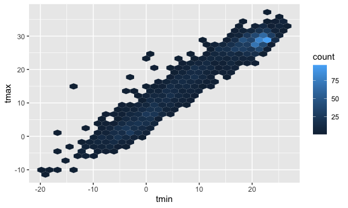<!-- -->

### line

``` r
weather_df |> 
  filter(name == "Molokai_HI") |>
  ggplot(aes(x = date, y = tmax)) +
  geom_line(alpha = .5) +
  geom_point(size = .5)
```

    ## Warning: Removed 1 rows containing missing values (`geom_point()`).

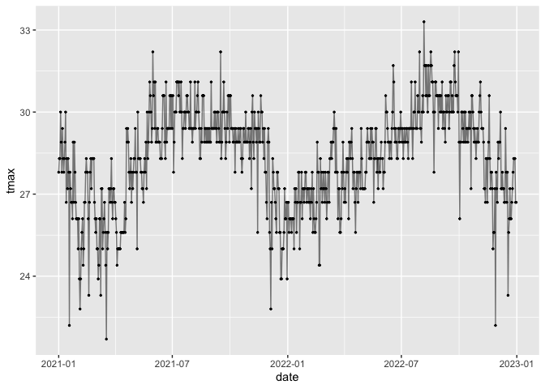<!-- -->

## univariate plotting

### histogram

``` r
ggplot(weather_df, aes(x = tmax, fill = name)) +
  geom_histogram(position = "dodge")
```

    ## `stat_bin()` using `bins = 30`. Pick better value with `binwidth`.

    ## Warning: Removed 17 rows containing non-finite values (`stat_bin()`).

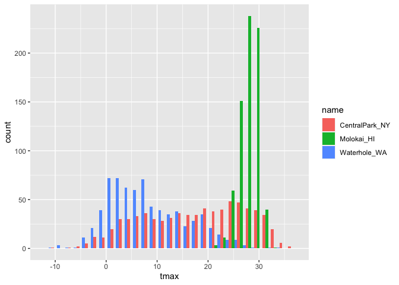<!-- -->

### density plot

``` r
ggplot(weather_df, aes(x = tmax, fill = name)) +
  geom_density(alpha = 0.3, adjust = .75)
```

    ## Warning: Removed 17 rows containing non-finite values (`stat_density()`).

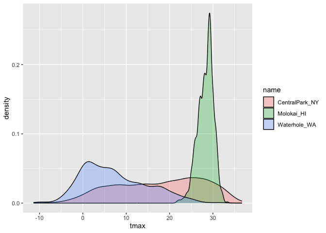<!-- -->

### box plot

``` r
ggplot(weather_df, aes(y = tmax, x = name)) +
  geom_boxplot()
```

    ## Warning: Removed 17 rows containing non-finite values (`stat_boxplot()`).

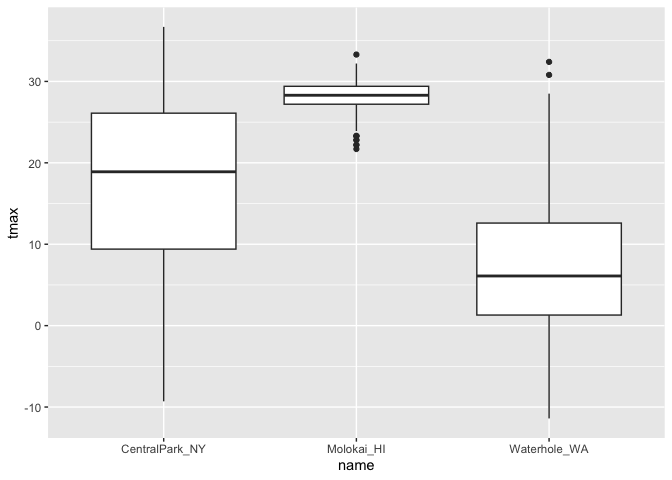<!-- -->

### violin plot

``` r
ggplot(weather_df, aes(y = tmax, x = name)) +
  geom_violin()
```

    ## Warning: Removed 17 rows containing non-finite values (`stat_ydensity()`).

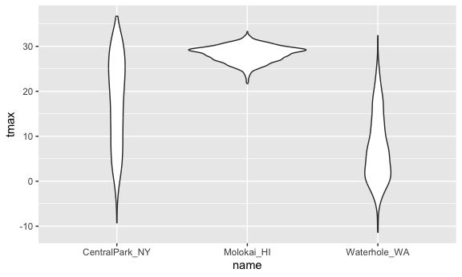<!-- -->

### ridge plot

``` r
ggplot(weather_df, aes(x = tmax, y = name)) +
  geom_density_ridges()
```

    ## Picking joint bandwidth of 1.54

    ## Warning: Removed 17 rows containing non-finite values
    ## (`stat_density_ridges()`).

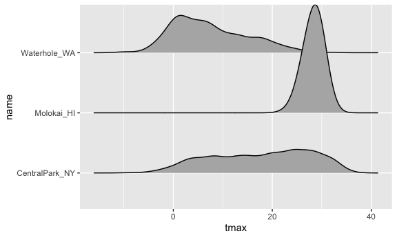<!-- -->
